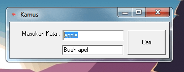

# Kamus Kata Sederhana

Ini adalah kamus kata sederhana yang dibuat dalam format teks. Kamus ini berisi daftar kata-kata beserta arti mereka dalam bahasa Indonesia.

## Penggunaan

Kamus ini dapat digunakan untuk mencari arti kata-kata dalam bahasa Indonesia. Anda dapat mencari kata tertentu dengan menggunakan fungsi pencarian pada teks editor atau membuka kamus ini secara langsung.

## Daftar Kata

Berikut adalah contoh daftar kata dan artinya dalam kamus ini:

- apple=Buah apel
- banana=Buah pisang
- car=Mobil

(Anda dapat menambahkan sebanyak mungkin kata yang Anda inginkan.)

## Kontribusi

Jika Anda ingin berkontribusi untuk pengembangan kamus ini, Anda dapat melakukan hal berikut:

1. Fork repositori ini.
2. Tambahkan kata-kata dan arti mereka sesuai kebutuhan.
3. Buat pull request dengan perubahan Anda.

Kami sangat menghargai kontribusi dari pengguna untuk memperkaya kamus ini.

## Lisensi

Kamus Kata Sederhana ini memiliki lisensi berikut:

[MIT License](LICENSE)

